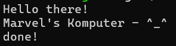

# Module10-AsynchronousProgramming

## Tutorial 1:

So I added println!("Hello there!"); outside and after the spawner.spawn block. The output shows that "Hello there!" is printed before the text inside the spawned async block. This happens because spawner.spawn only builds the future and sends it to the task queue; it does not execute it immediately. The main thread continues to execute the synchronous println! statement. The async block only begins executing later when executor.run() is called, which polls the queued futures.