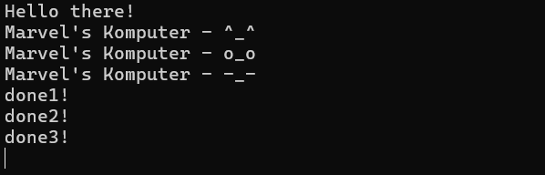

# Module10-AsynchronousProgramming

## Tutorial 1:

### Experiment 1.2:

So I added println!("Hello there!"); outside and after the spawner.spawn block. The output shows that "Hello there!" is printed before the text inside the spawned async block. This happens because spawner.spawn only builds the future and sends it to the task queue; it does not execute it immediately. The main thread continues to execute the synchronous println! statement. The async block only begins executing later when executor.run() is called, which polls the queued futures.

### Experiment 1.3:

Explanation: > In this experiment, I spawned three different tasks and observed the behavior of the program when drop(spawner) is removed.

Multiple Spawns: The output shows that the start messages for all three tasks are printed before any of the "done!" messages. This demonstrates concurrency. The executor polls a task until it blocks (the 2-second timer), then immediately moves on to poll the next task in the queue.

Removing drop(spawner): When drop(spawner) is removed, the program never exits and hangs indefinitely. This happens because the Executor and Spawner communicate via an mpsc channel. The executor's run function uses a while loop to continuously receive tasks from the queue. This loop only terminates when the channel is closed, and the channel only closes when all Sender instances are dropped. If we don't drop the spawner, the main thread keeps the sender alive, causing the executor to wait forever for new messages that will never arrive.

h